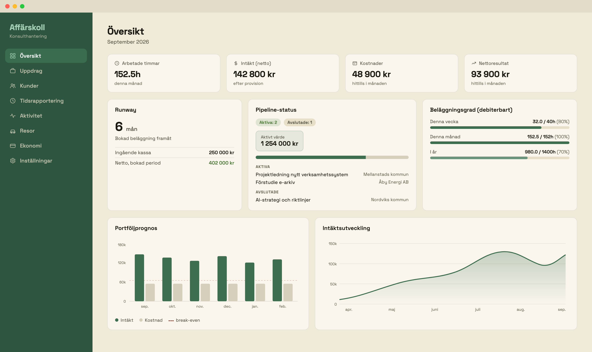
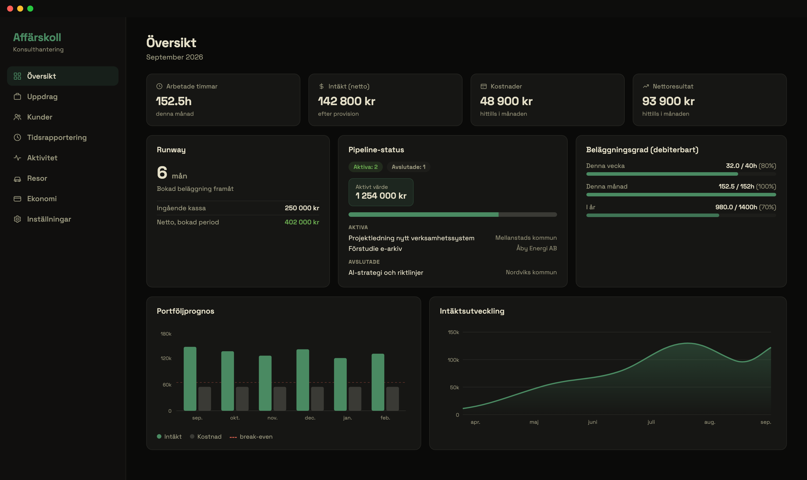
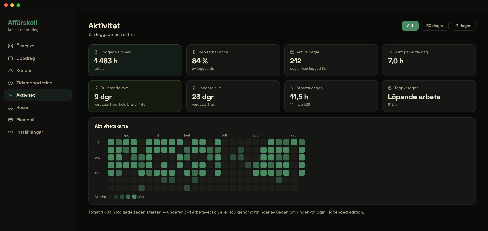

# Affärskoll

Konsulthantering, tidsrapportering och ekonomisk planering för svenska enmanskonsulter — byggd för vardagen i ett eget aktiebolag.

Affärskoll samlar det en fristående konsult behöver ha koll på: uppdragen, timmarna, fakturorna, momsen och prognosen. Allt räknat efter svenska regler (kommunalskatt, arbetsgivaravgifter, 3:12, milersättning, kvartals-/årsmoms) och med stöd för att fakturera via en förmedlingspartner som tar provision.

Fritt att forka och driftsätta för eget bruk. MIT-licens.



| Mörkt läge | Aktivitetsvyn |
|---|---|
|  |  |

*Skärmdumparna visar demodata.*

## Funktioner

- **Översikt** — intäkter, kostnader, nettoresultat, runway och faktureringskö
- **Uppdrag** — status, arbetspaket, budgetvarningar, lönsamhet per uppdrag, tjänsteställebedömning (SKV)
- **Kunder** — kundregister med fakturauppgifter och kommunikationslogg
- **Tidsrapportering** — veckovy, snabbloggning, kopiera förra veckan, export till CSV/PDF
- **Aktivitet** — heatmap över loggade timmar, vardagssviter och toppstatistik
- **Resor** — körjournal med kvittofoton och reseräkning som PDF
- **Ekonomi** — fakturagenerator med PDF, löpnummerserie, betal-QR, tidrapportbilaga och dubbelfaktureringsskydd; momslogg med deklarationstillfällen; kalkyl för timpris, nettolön och utdelning (3:12); kunskapsbas med vanliga bokföringsscenarier på svensk BAS-kontoplan
- **AI-assistent** (tillval) — frågor om din egen data och momstolkning i fritext; utan API-nyckel döljs AI-ytorna automatiskt och allt annat fungerar som vanligt
- Kommandopalett (Cmd+K), mörkt läge, mobilanpassad

## Teknik

Next.js 15 (App Router), React 19, TypeScript, Tailwind CSS + shadcn/ui, Clerk (auth), Neon (serverless PostgreSQL), Drizzle ORM, TanStack React Query, Recharts, jsPDF. Deployas enklast på Vercel. Alla tjänster har fria nivåer som räcker gott för en person.

## Kom igång

### 1. Klona och installera

```bash
git clone <repo-url>
cd affarskoll
npm install
```

### 2. Miljövariabler

```bash
cp .env.example .env
```

Fyll i värdena i `.env`:

- **Clerk** — skapa en app på [dashboard.clerk.com](https://dashboard.clerk.com) (gratis)
- **Neon** — skapa en databas på [console.neon.tech](https://console.neon.tech) (gratis)
- **ANTHROPIC_API_KEY** — tillval; utan nyckel döljs AI-funktionerna automatiskt
- **CRON_SECRET** — valfri slumpsträng, skyddar notisjobben

### 3. Databas

```bash
npm run db:push
```

### 4. Kör

```bash
npm run dev
```

Öppna [http://localhost:3000](http://localhost:3000), logga in och gå till **Inställningar** för att fylla i ditt bolags uppgifter (organisationsnummer, bankgiro, logotyp, skattesatser, eventuell förmedlingspartner).

## Driftsätta på Vercel

1. Pusha till GitHub
2. Importera i [Vercel](https://vercel.com/new)
3. Lägg in miljövariablerna (sätt `NEXT_PUBLIC_APP_URL` till din publika URL)
4. Deploya

Cron-jobben i `vercel.json` (dagliga och veckovisa notiser) aktiveras automatiskt.

## Projektstruktur

```
src/
  app/              # Next.js App Router-sidor
    (app)/          # Inloggad app (översikt, uppdrag, tid, aktivitet, ekonomi ...)
    (auth)/         # Inloggning/registrering
    api/            # API-routes
  components/       # React-komponenter
    ui/             # shadcn/ui-primitiver
    layout/         # Sidofält, mobilnav, kommandopalett
  hooks/            # React Query-hooks
  lib/              # Affärslogik (skatt, moms, intäkter, faktura-PDF)
    db/             # Drizzle-schema och klient
  data/             # Svenska kommunalskatter och momsscenarier
```

## Viktigt att veta

Appen ger **underlag, inte skatterådgivning**. Beräkningarna följer svenska regler efter bästa förmåga, men du ansvarar själv för deklarationer och bedömningar — stäm av med din redovisningsbyrå.

## Licens

MIT — se [LICENSE](LICENSE).
